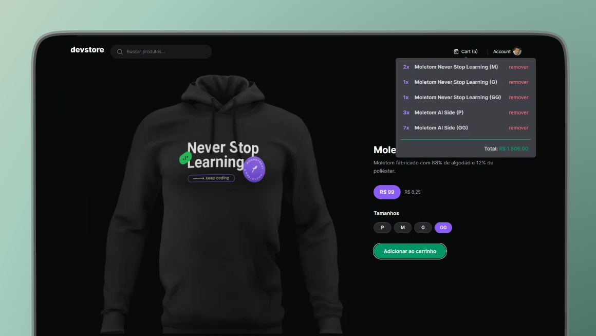

<h1 align="center">devstore</h1>

<br />
<p align="center"> 
   
	 
  	<a href="https://github.com/brunosduarte/dev-store/commits/master"> 
   		 
 	</a> 
  	<a href="https://opensource.org/licenses/MIT"> 
   		 
  	</a> 
</p>

## 🗂 Contents

- 📋 [Project](#-project)
  - 🚀 [Technologies](#-technologies)
  - 📷 [Preview](#-preview)
- 📦 [Instalation](#-instalation)
- ⚖️ [License](#%EF%B8%8F-license)
- 📫 [Contact](#-contact)

## 📋 Project

An e-commerce web application built in RocketSeat's Ignite course. The goal of this application was to apply the concepts introduced from Next 13, which essentially involve sending less JavaScript to the client side, using concepts such as Server Components to achieve this objective.
Additionally, Cypress was also used in this application to perform end-to-end (E2E) tests on the web.

### 🚀 Technologies

[](https://react.dev)
[](https://nodejs.org)
[](https://nextjs.org)
[](https://www.typescriptlang.org)
[](https://tailwindui.com)
[](https://docs.cypress.io)

## 📷 Preview

##### 💻 frontend:

<p align="center"> 
  
</p>

## 📦 Instalation

To clone and run this application, you will need [Git][git], [NodeJS v18.17.1][nodejs] or higher + [npm v9.17.1][npm] or higher, and [PNPm 8.7.5][pnpm] installed on your computer. In your terminal, run:

```bash
# Cloning repo
$ git clone https://github.com/brunosduarte/dev-store.git dev-store
```

```bash
# Installing pnpm
$ npm install -g pnpm
```

```bash
# Frontend

# Got to the repository
$ cd web

# Install dependencies
$ pnpm i

# Execute
$ pnpm run dev
```

## ⚖️ License

This project is under license. [MIT](LICENSE).

## 📫 Contact

by [**Bruno Duarte**](https://www.linkedin.com/in/brunosduarte/) 🚀

[nodejs]: https://nodejs.org/
[PNPm]: https://pnpm.io/pt/
[npm]: https://www.npmjs.com/
[git]: https://github.com/
